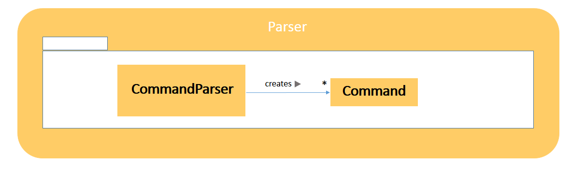

# Introduction
Todoer is a keystroke-orientated task manager that allows users to manage to-do lists in a virtual scheduler. It is a Java desktop application that has a Text UI.

This guide describes the design and implementation of Todoer. It will help you understand how Todoer works. We have organised this guide in a top-down manner so that you can understand the big picture before moving on to the more detailed sections.

# Table of Contents
<!-- MarkdownTOC -->

- [Architecture](#architecture)
- [UI Component](#uicomponent)
  - [MainApp Class](#mainapp-class)
  - [TableHelper Class](#tablehelper-class)
- [Logic Component](#logiccomponent)
  - [MainLogic Class](#mainlogic-class)
  - [Task Class](#task-class)
  - [History Class](#history-class)
- [Parser Component](#commandparsercomponent)
- [Storage Component](#storagecomponent)
  - [JSONConverter Class](#jsonconverter-class)
- [Testing](#testing)
- [Future Development](#futuredevelopment)

<!-- /MarkdownTOC -->

# Architecture

<br>

> Figure 1: Top-level component architecture of Todoer

Architecture is made up of 4 main components. Users can use Todoer through the UI component.

1. The **`UI`** component consists of Java Frame files which define the layout that users interact with.

2. The **`logic`** component contains all the logic needed to execute the users' commands.

3. The **`parser`** component is responsible for processing the raw user commands and passing the semantics of the command to the logic component to handle its execution.

4. The **`storage`** component reads and writes the tasks' content to the file system. 

# UI Component

<br>

> Figure 2: Structure of the UI Component

Todoer's UI consists of two packages: `control` and `view`. The `control` package contains files that control what users see and the `view` package contains the layout of the Todoer UI implemented using Java's JFrame class.

UI maintains a reference to Logic, calling Logic’s methods directly to trigger processing of user-entered commands.

## `MainApp` Class
This is the starting point and main driver of the whole program. It initialises an instance of the `MainLogic` class in `Logic` to be used throughout the lifetime of the program. `MainApp` can passes the value of the user input to the `MainLogic` class to get back a feedback string. The `MainApp` then generates what is to be displayed on the UI through calling methods of the `TableHelper` class.

## `TableHelper` Class

`TableHelper` is responsible for creating the table and timetable displays in Todoer. It uses `DateTimeHelper` methods to display date times appropriately.

###### Notable API

| Return type   | Method and Description                                            |
|-------------|----------------------------------------------------------|
| void | createTableToDisplayTasks(): creates the standard table view for the tasks passed to the UI   |
| String | createTimeTable(String userCommand): returns the string data to be placed in the timetable  |

# Logic Component

<br>

> Figure 3: Structure of the Logic Component

At the heart of the Logic component is the `MainLogic` class that is responsible for executing the user’s commands. A `Task` class is also used to represent the tasks to be done. A `History` class stores a record of the data state in `DataState` objects after each user action modification. There are also several helper classes: `DateTimeHelper`, `Settings`, and `Comparators`; the helper classes will not be discussed in this developer guide, you may find the API in Appendix A.

## `MainLogic` Class 

The `MainLogic` class has a public method `process()` for the UI to call and pass the user’s input into. `MainLogic` will then pass the user’s input to the `CommandParser` class to get back the command’s details. Finally, it will execute the command depending on what type of command it is and return the feedback to the UI. While executing the command, `MainLogic` makes use of the `Storage` class to do any input/output operation.

``` java
public MainLogic() {
	TaskCommandParser mTaskCommandParser = new TaskCommandParser();
	mTaskStorage = new TaskStorage();
	allTasks = new ArrayList<Task>();
	…
}
```
``` java
protected String process(String userCommand) {
String command = "", taskInfo = "";
	String[] commandInfo = mTaskCommandParser.getCommandInfo(userCommand);
	command = commandInfo[0];  taskInfo = commandInfo[1];
		
	switch (command){
		case "add":
			Task newTask = new Task(taskInfo);
			allTasks.add(newTask);
			…
			return "Successfully added '" + taskInfo + "'\n";
		case "delete":
			…
			allTasks.remove(i);
			return "'"+deleted+"' was removed successfully\n";
		…
		case "exit":
			return null;
		default:
			return "Syntax error: command(" + command + ") not found.\n";
	}
		
}
```
The code snippets above show how the list of all tasks is represented as an ArrayList of Task object in the `MainLogic`. When processing a command, `MainLogic` will add/delete/update these `Task` objects accordingly and rewrite the data to the files when necessary.

The diagram (see Figure 4) below demonstrates how the major components of the software interact in a typical cycle of command execution. The raw user command “delete task1” in this example would first be fed from the UI to the Logic, and then to the CommandParser. Upon receiving the command’s details from the CommandParser, the Logic can either read or write the tasks’ content from the Storage however it sees fit and finally, return a feedback string to the UI to be displayed to the user.


> Figure 4: Object interactions for execution of 'delete' command in Todoer

###### Notable API

| Return type   | Method and Description                                            |
|-------------|----------------------------------------------------------|
| String | process(userCommand): execute the command and return a feedback string   |

## `Task` Class

`Task` class is used to represent the tasks in the program. It contains methods to get or set the properties of the tasks (such as name, deadline, whether it is recurrent,…).

###### Notable API

| Return type   | Method and Description                                            |
|-------------|----------------------------------------------------------|
| String | getName(): get the name of the task  |
| void | setName(String newname): set a new name for the task  |
| String | getDeadline(): get the deadline of the task  |
| void | setDeadline(String newdeadline): set a new deadline for the task  |

## `History` Class

`History` class is used to store snapshots of the program after each user modification to the task data. It creates and saves previous states of the data in `DataState` objects. This facilitates the `undo`/`redo` commands which toggle between the data states and hence reverse user actions.

###### Notable API

| Return type   | Method and Description                                            |
|-------------|----------------------------------------------------------|
| void | updateHistory(ArrayList<Task>): update history after user modifications to task data |
| ArrayList<Task> | undo(): returns the list of tasks before last user modification |
| ArrayList<Task> | redo(): returns the list of tasks after the next user modification |

# Parser Component

<br>

> Figure 5: Structure of the Parser Component

The Parser component consists of a `CommandParser` class which receives the raw user input from the `Logic` component and creates a `Command` object which is executed by `Logic`.

###### Notable API

| Return type   | Method and Description                                            |
|-------------|----------------------------------------------------------|
| String[] | getCommandInfo(String userCommand): return the details of the user’s command  |

# Storage Component

<br>

> Figure 6: Structure of the Storage Component

The `Storage` component consists of a `Storage` class that manages the reading and writing of data between the program and the file system. Since we are storing tasks as JSON strings in the data files, there is also a `JSONConverter` class that encodes and decodes between JSON strings and `Task` objects.

## `Storage` class
This class has public methods for the `MainLogic` to call to read and write the content of the tasks to the data files. The data files consist of a cache (default to be data.txt) that stores the users’ tasks to disk. The `Storage` class also has a private internal arrayList entryList that mirrors the content in the cache file.

###### Notable API

| Return type   | Method and Description                                            |
|-------------|----------------------------------------------------------|
| void | rewriteContent(ArrayList<Task> allTasks): rewrite the content of the tasks to the data file   |
| ArrayList<Task> | readContent(): read the tasks from the data file   |
| void | setFileURL(String fileURL): set the URL for the data file   |

## `JSONConverter` Class
The `JSONConverter` class provide an `encodeTask` method to encode the details of a Task object to a JSON string and a `decodeJSON` method to decode a JSON string to get a `Task` object.

| Return type   | Method and Description                                            |
|-------------|----------------------------------------------------------|
| String | encodeTask(Task task): encode the Task object to a JSON String   |
| Task | decodeJSON(String json): decode a JSON string to get a Task object   |

# Testing

JUnit is used to perform unit tests on all the major commands in Todoer (add, delete, done, update etc.) to ensure everything works as intended. 

Run TestTodoer.java in Eclipse IDE to test Todoer.


# Future Development

There are several additions that can be made to Todoer to further increase its usefulness and usability.

###### Notifications/Events
We seek to further develop the pop-up and audio notification functionality to update/remind the Todoer user about urgent tasks or tasks that are nearing due date. We would like to allow user to be to customize the frequency and sound of these notifications.

###### Further improved GUI
We would like to implement additional helpful features such as auto-fill commands (by referencing the user’s past command history) and by displaying urgent/important tasks more prominently (perhaps with color coding).
