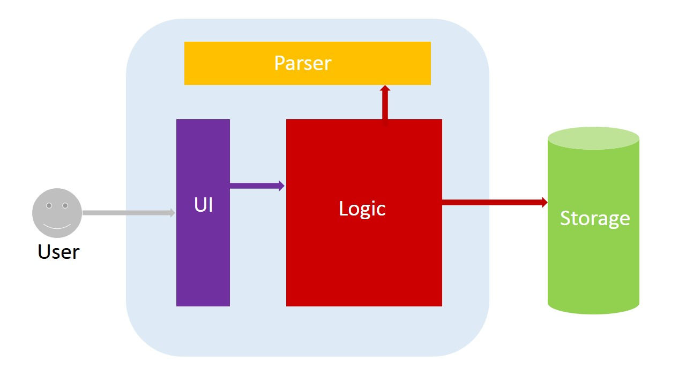

# Introduction
Todoer is a keystroke-orientated task manager that allows users to manage to-do lists in a virtual scheduler. It is a Java desktop application that has a Text UI.

This guide describes the design and implementation of Todoer. It will help you understand how Todoer works. We have organised this guide in a top-down manner so that you can understand the big picture before moving on to the more detailed sections.

# Table of Contents
<!-- MarkdownTOC -->

- [Architecture](#architecture)
- [UI Component](#uicomponent)
  - [MainApp Class](#mainapp-class)
  - [UIController Class](#uicontroller-class)
- [Logic Component](#logiccomponent)
  - [MainLogic Class](#mainlogic-class)
  - [Task Class](#task-class)
- [CommandParser Component](#commandparsercomponent)
- [Storage Component](#storagecomponent)
  - [JSONConverter Class](#jsonconverter-class)
- [Testing](#testing)
- [Future Development](#futuredevelopment)

<!-- /MarkdownTOC -->

# Architecture

<br>


Architecture is made up of 4 main components. Users can use Todoer through the UI component.

1. The **`UI`** component consists of Java Frame files which define the layout that users interact with.

2. The **`logic`** component contains all the logic needed to execute the users' commands.

3. The **`parser`** component is responsible for processing the raw user commands and passing the semantics of the command to the logic component to handle its execution.

4. The **`storage`** component contains the cache that saves users’ tasks as well as configuration files.

# UI Component
The UI component consists of a MainApp class that is responsible for managing the input obtained from the UI and output to be displayed on the UI. The UI itself is created by the UIController class which manages the appearance and behaviour of the UI.

Todoer’s UI consists of two parts: Text field and Display field.

Both fields are implemented using Java’s JFrame class to create a simple Window where the Text field gets the user’s command, and Display field displays messages to the user (scrollable). 
UI maintains a reference to Logic, calling Logic’s methods directly to trigger processing of user-entered commands.

## `MainApp` Class
This is the starting point of the whole program. It initialises an instance of the MainLogic class and an instance of the UIController class to be used throughout the lifetime of the program. It has a public method handleKeyPress() to be called by the UIController whenever the user presses a key on the command bar. Depending on the key pressed, the MainApp can pass the value of the user input to the MainLogic class to get back a feedback string. The MainApp then decide what to be displayed on the UI through calling methods of the UIController class.

###### Notable API

| Return type   | Method and Description                                            |
|-------------|----------------------------------------------------------|
| void | handleKeyPress(char key, String userInput): handler for when a key is pressed in the command bar   |

## `UIController` Class
This class defines the looks and feels of the Text field (or command bar) and Display field. It signals the MainApp whenever a key is pressed by calling the method handleKeyPress(). It also has public methods for the MainApp to change the content of the fields.


| Return type   | Method and Description                                            |
|-------------|----------------------------------------------------------|
| void | clearCommandBar(): clear the command bar   |
| void | clearDisplay(): clear the display panel   |
| void | display(String s): add a string to the display panel   |

# Logic Component

<br>


At the heart of the Logic component is the MainLogic class that is responsible for executing the user’s commands. A Task class is also used to represent the tasks to be done. 

## `MainLogic` Class 

The MainLogic class has a public method process() for the UI to call and pass the user’s input into. MainLogic will then pass the user’s input to the TaskCommandParser class to get back the command’s details. Finally, it will execute the command depending on what type of command it is and return the feedback to the UI. While executing the command, MainLogic makes use of the TaskStorage class to do any input/output operation.


``` java
public MainLogic() {
	TaskCommandParser mTaskCommandParser = new TaskCommandParser();
	mTaskStorage = new TaskStorage();
	allTasks = new ArrayList<Task>();
	…
}
protected String process(String userCommand) {
String command = "", taskInfo = "";
	String[] commandInfo = mTaskCommandParser.getCommandInfo(userCommand);
	command = commandInfo[0];  taskInfo = commandInfo[1];
		
	switch (command){
		case "add":
			Task newTask = new Task(taskInfo);
			allTasks.add(newTask);
			…
			return "Successfully added '" + taskInfo + "'\n";
		case "delete":
			…
			allTasks.remove(i);
			return "'"+deleted+"' was removed successfully\n";
		…
		case "exit":
			return null;
		default:
			return "Syntax error: command(" + command + ") not found.\n";
	}
		
}
```
The code snippets above show how the list of all tasks is represented as an ArrayList of Task object in the MainLogic. When processing a command, MainLogic will add/delete/update these Task objects accordingly and rewrite the data to the files when necessary.

<br>


###### Notable API

| Return type   | Method and Description                                            |
|-------------|----------------------------------------------------------|
| String | process(userCommand): execute the command and return a feedback string   |

## `Task` Class

`Task` class is used to represent the tasks in the program. It contains methods to get or set the properties of the tasks (such as name, deadline, whether it is recurrent,…).

###### Notable API

| Return type   | Method and Description                                            |
|-------------|----------------------------------------------------------|
| String | getName(): get the name of the task  |
| void | setName(String newname): set a new name for the task  |
| String | getDeadline(): get the deadline of the task  |
| void | setDeadline(String newdeadline): set a new deadline for the task  |

# CommandParser Component

The Parser component only consists of a CommandParser class which receives the raw user input and returns the details of the command in the form of an ArrayList of String objects.

The first element of the ArrayList is always the command keyword, while the remaining elements could be the task name or deadline, depending on the type of the command.

| Return type   | Method and Description                                            |
|-------------|----------------------------------------------------------|
| String[] | getCommandInfo(String userCommand): return the details of the user’s command  |

###### Notable API

| Return type   | Method and Description                                            |
|-------------|----------------------------------------------------------|
| String[] | getCommandInfo(String)   |

# Storage Component

<br>


The Storage component consists of a Storage class that manages the reading and writing of data between the program and the file system. Since we are storing tasks as JSON strings in the data files, there is also a JSONConverter classes that encodes and decodes between JSON strings and Task objects.

## `Storage` class
This class has public methods for the MainLogic to call to read and write the content of the tasks to the data files. The data files consist of a cache (default to be cache.txt) that stores the users’ tasks to disk as well as a configuration file (config.txt) that remembers the user’s settings for Todoer. The Storage class also has a private internal arrayList entryList that mirrors the content in the cache file.

###### Notable API

| Return type   | Method and Description                                            |
|-------------|----------------------------------------------------------|
| void | rewriteContent(ArrayList<Task> allTasks): rewrite the content of the tasks to the data file   |
| ArrayList<Task> | readContent(): read the tasks from the data file   |
| void | setFileURL(String fileURL): set the URL for the data file   |

## `JSONConverter` Class
The `JSONConverter` class provide an encodeTask method to encode the details of a Task object to a JSON string and a decodeJSON method to decode a JSON string to get a Task object.

| Return type   | Method and Description                                            |
|-------------|----------------------------------------------------------|
| String | encodeTask(Task task): encode the Task object to a JSON String   |
| Task | decodeJSON(String json): decode a JSON string to get a Task object   |

# Testing

JUnit is used to perform unit tests on the UI, Logic, Parser, and Storage components. Every method is unit tested to ensure everything works as intended.

# Future Development

There are several additions that can be made to Todoer to further increase its usefulness and usability.

###### Notifications/Events
We seek to develop the functionality to update/remind the Todoer user about urgent tasks or tasks that are nearing due date with say, pop-ups or audio notifications.

###### GoodGUI
Current GUI is minimalistic. We would like to implement additional helpful features such as auto-fill commands (by referencing the user’s past command history) and by displaying urgent/important tasks more prominently (perhaps with color coding).

