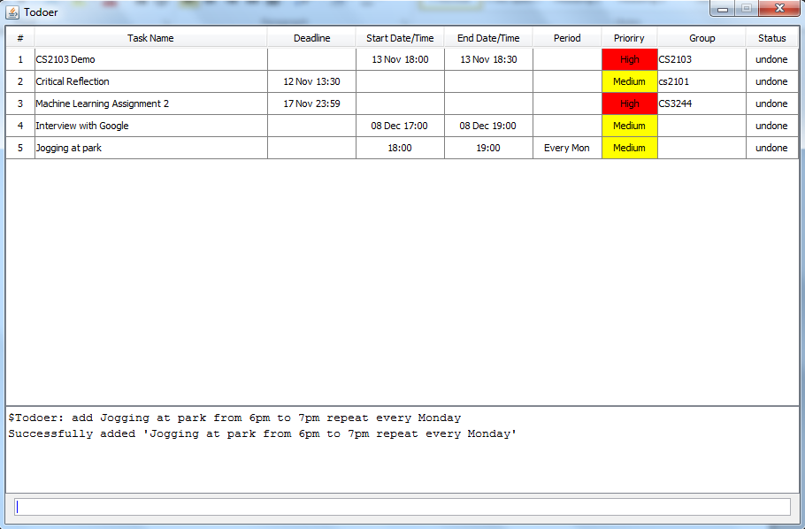

# Todoer

Do you have a huge amount of tasks and other things to do that you just can't keep track of? Have you ever wished for an application that remembers all your tasks and allows you to keep track of your schedule? 

Todoer does all that and more! It is a keystroke-orientated tool that will assist you in managing your to-do's and other events in your busy schedule: 

**Want to use Todoer?**
* [**User Guide**](User Guide.md)

**Want to contribute to Todoer?**
* [**Developer Guide**](Developer Guide.md)
