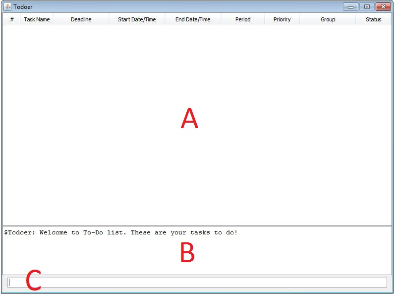
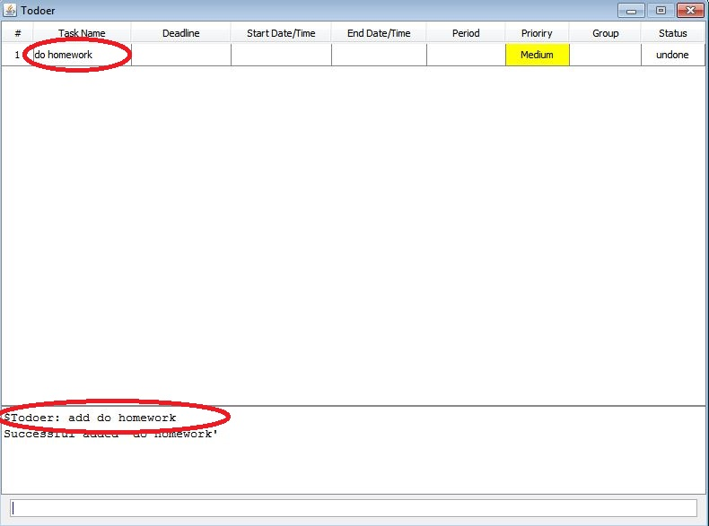
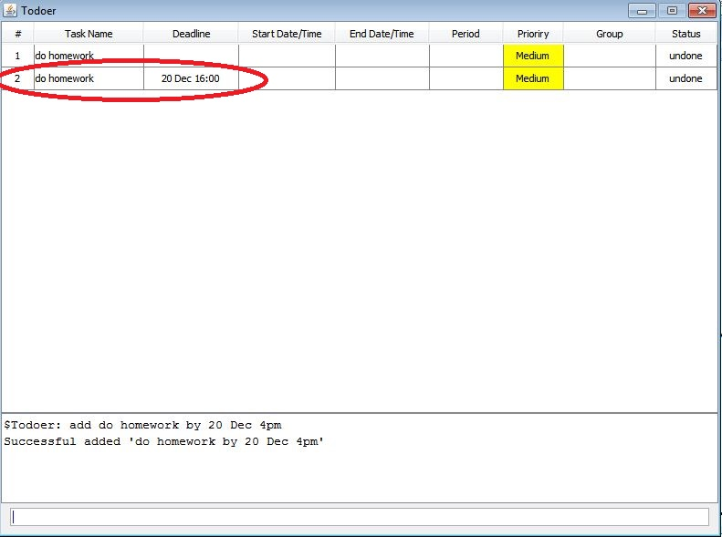
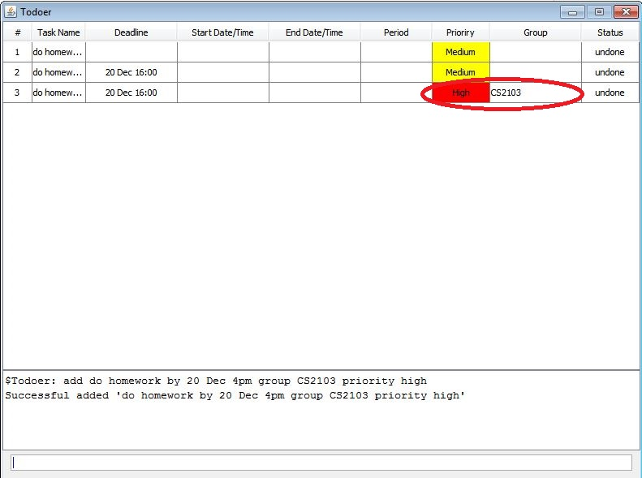
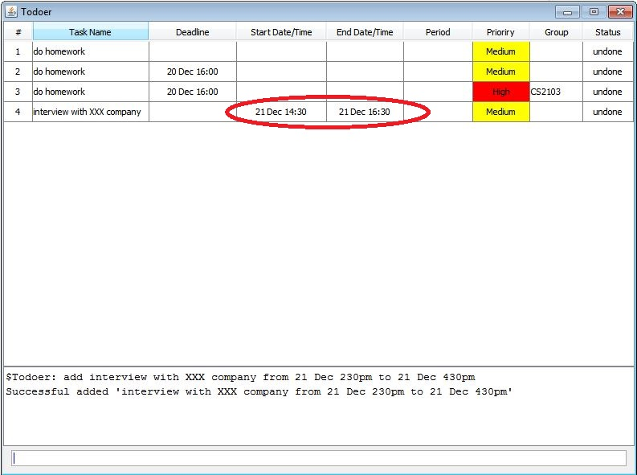
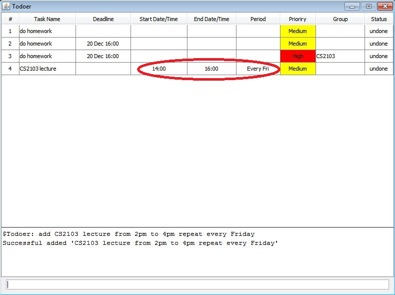
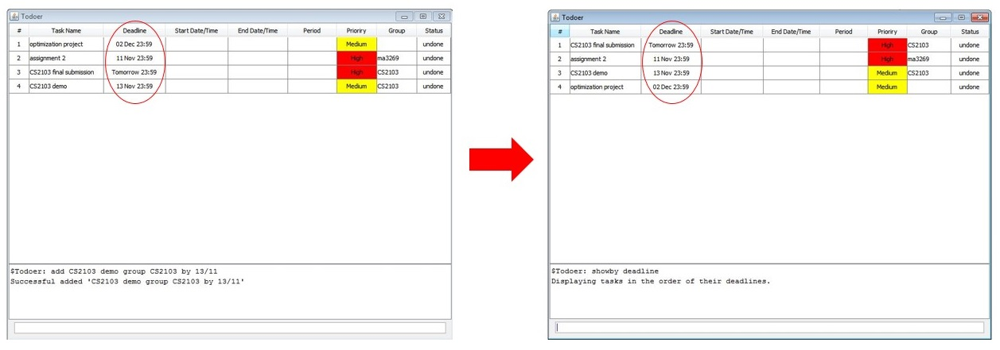

# About
Todoer is a keystroke-orientated task scheduler that provides functionality for managing to-do lists. The UI is designed to provide a 'command-line' feel that we know our users will love. Follow this guide to learn how to use Todoer effectively.

# Table of Contents
<!-- MarkdownTOC -->

- [Getting Started](#getting-started)
- [Feature Details](#feature-details)
  - [Adding a task](#adding-a-task)
  - [Deleting a task](#deleting-a-task)
  - [Viewing tasks](#viewing-tasks)
  - [Updating a task](#updating-a-task)
  - [Settings](#settings)
  - [Exiting](#exiting)
  - [Help](#help)
- [Cheatsheet](#cheatsheet)

<!-- /MarkdownTOC -->

# Getting Started

1. **Download Todoer**: You can save Todoer into any folder of your choice. All your data will be saved in this folder.

2. **Launch Todoer**: by simply double-clicking the `Todoer.exe file`.

3. You will be greeted with an interface that has (*see below*) a main panel (**A**), a console (**B**), and a command bar (**C**). This command bar is where you enter commands to tell Todoer what to do. The console displays helpful feedback for your actions and the main panel displays your tasks.   
 

4. **Try adding a task!**: Type `add do homework by tomorrow` in the command bar. You will see your first task added to the table in the main panel. The deadline for this task is tomorrow and its exact date will be added into the `deadline` column.

7. **Try more commands**: 
     * `showall` - See all outstanding tasks
     * `done do homework` - Mark the task as done
     * `exit` - Exit Todoer using the command bar

To learn more details of Todoer features, refer to the 'Feature Details' section below.

# Feature Details
## Adding a task
1. Type `add <task_name>` into the command bar. This adds the most basic task, without any deadlines or additional information; to add additional information in a task, see the below steps.

> Example: **`add do homework`**
 

### **`OPTIONAL: Deadlines`**
1. Type `add <task_name> by <deadline>`. Replace \<deadline> with a future date, the following formats are acceptable:
  * tomorrow
  * next <day>. (e.g. next Tuesday/Tue)
  * dd/mm (e.g. 20/12)
  * dd mmm (e.g. 20 Dec)
  * dd mmmm (e.g. 20 December)
2. You may append a time to the date for a more specific deadline. AM/PM or 24 hour time formats are acceptable. (The default is "23:59" if time is not specified) 

> Example: **`add do homework by 20 Dec 4pm`**

> Todoer is human readable and friendly! Experiment with different datetime formats, you will find that most of them are recognized. See the cheatsheet section for a list of all recognized formats.

 

### **`OPTIONAL: Groups and Priority`**
1. Append `group <group_name>` and/or `priority <high/meduim/low>` to your `add` command. Replace \<group_name> with an appropriate categorization of your choice and choose one of **high**, **medium**, or **low** to indicate how urgent the task is to you. 

> Example: **`add do homework by 20 Dec 4pm group CS2103 priority high`**

 

### **`OPTIONAL: Start time/End time`**
1. Append a `from <start_datetime> to <end_datetime>` to your `add` command. As usual, replace the fields with a flexible datetime of your choice. Use this feature when you have an event task that will occupy a known duration on your schedule.

> Example: **`add interview with XXX company from 21 Dec 230pm to 21 Dec 430pm`**

> (The start time and end time defaults to 00:00 and 23:59 respectively if not specified.)
 
 

### **`OPTIONAL: Recurring tasks`**
1. Append `from <start time> to <end time> repeat <period>` to your `add` command. The repeat keyword will schedule the specified task continuously over the given \<period>. The following formats for \<period> are acceptable:
  * every day
  * every \<day_of_week>

  > Example: **`add CS2103 lecture from 2pm to 4pm repeat every Friday`**
  * every <day_of_week> from \<start_date> to \<end_date>

  > Example: **`add practice guitar from 6pm to 7pm repeat every Mon from 16/12 to 30/12`**
  
   
  

### Keyword List

| Keyword   | Usage                                            |
|-------------|----------------------------------------------------------|
| add | add \<task_name>   |
| by | by \<deadline>   |
| group | group \<group_name>   |
| priority | priority \<high/medium/low>   |
| from...to | from \<start_datetime> to \<end_datetime>   |
| repeat | repeat \<period>   |

## Marking a task done
1. Type `done <task_name>` into the command bar to mark \<task_name> as a completed task.
2. Alternatively, type `done id <id_number>` to mark the task with id \<id_number> done.
3. If you wish to permanently delete a task from your records, see the `delete` section below.

## Deleting tasks
###### Deleting a specific task
1. Type `delete <task_name>` into the command bar. Replace \<task_name> with the name of the task you wish to delete.
2. Alternatively, type `delete id <id_number>` to delete the task with id \<id_number> as displayed in the main panel.

###### Deleting a group of tasks
1. Type `deleteby <field> <value_of_field>`. Replace \<field> by one of the column names in the main panel.

> Example: `deleteby group CS2103`, `deleteby status done`

###### Deleting all tasks
1. Type `deleteall` into the command bar. 

> Tip: Use the undo/redo commands to reverse your actions.

## Viewing tasks
This section describes the different ways in which you can view your tasks, either by sorting on certain fields (e.g. in ascending deadline), or displaying only a subset of all your tasks (e.g. only tomorrow's tasks), or by searching for specific tasks, or in an intuitive timetable view.
### Showing tasks
###### Show tasks for a particular day
1. Type `showday <date>`
> Example: `showday 02/12`, `showday tomorrow`

###### Showpriority and Showgroup
1. Type `showpriority <high/medium/low>` or `showgroup <group_name>`

###### Sort on a field
1. Type `showby <field_name>`. Replace \<field_name> with **deadline**/**start date**/**end date**/**priority**/**group**/**status** to sort your tasks accordingly.

> Example `showby deadline`

   
  

###### Show all tasks
1. Type `showall` to display all tasks.

### Search
1. Type `search <keyword>` to find all tasks that have \<keyword> in them.

### Timetable
1. Type `timetable <date to display>` or `timetable from <date> to <date>` or simply, `timetable` to display for this week.

 

> Tip: Use the Page Up/Page Down keys to scroll up and down

## Updating a task
1. Type `update <task_to_be_updated> TO <keyword> <new value>
2. Refer to the keyword list in the add section [link?]
> Example: `update id 1 TO priority low`
> Take note that the keyword `TO` is capitalized

## Settings
###### Change the file that saves your tasks to disks
1. Type `setfile <filepath>`

## Exiting
1. Type `exit` in the command bar. The program will exit.

## Help
1. Type `help` in the command bar. (Type `showall` to revert back to the default view)

# Cheatsheet

| Command            | Usage                                                                                      |
|--------------------|--------------------------------------------------------------------------------------------------|
| add     | **add** \<task_name>. May append optional parameters: <ul><li>**by** \<deadline></li><li>**group** \<group_name></li><li>**priority** \<high/medium/low></li><li>**group** \<group_name></li><li>**from** \<start_datetime> **to** \<end_datetime></li><li>**repeat** \<period></li></ul> |
| done         | **done** \<task_name> or **done id** \<id_number> |
| delete  | <ul><li>**delete** \<task_name> or **delete** id <id_number></li><li>**deleteby** \<field> \<value_of_field></li><li>**deleteall**</li></ul>			                                             |
| update            | **update** \<task_name> TO \<keyword> \<new_value>                                                     |
| show               | <ul><li>**showday** \<date></li><li>**showpriority** \<high/medium/low></li><li>**showgroup** \<groupname></li><li>**showby** \<column_field></li><li>**showall**</li></ul>                            |
| timetable	| **timetable** to show this week or **timetable from** \<startdate> **to** \<enddate> |
| setfile           | **setfile** \<file_path>                                                   |
| help               | Display the helpsheet                       |
| exit               | Exit Todoer                                                                        |
